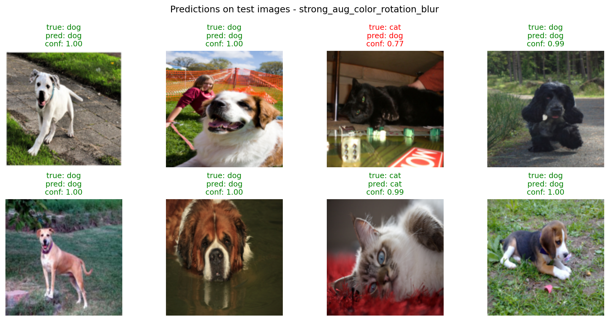
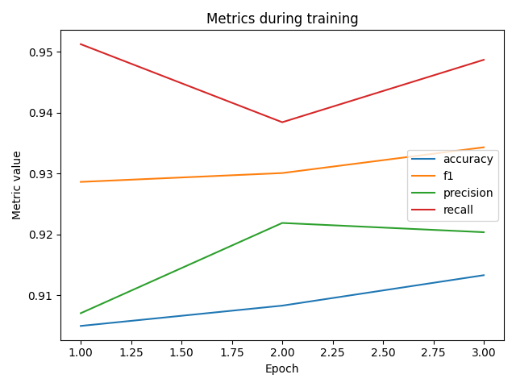
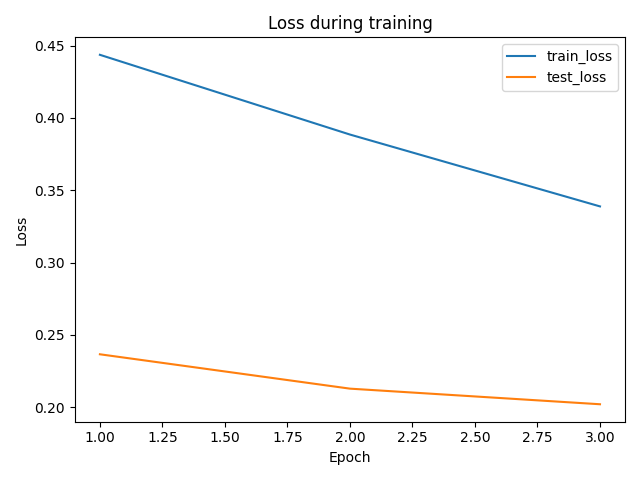
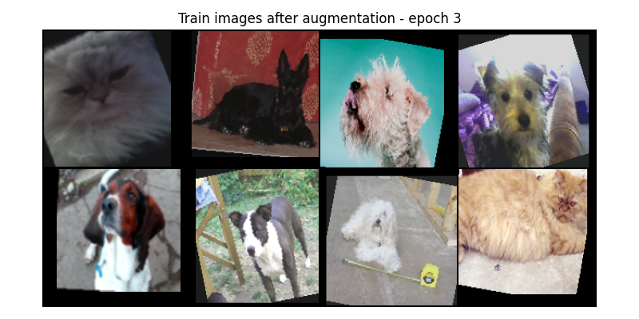

# Oxford Pets MLflow Augmentation

Cat vs dog image classification experiment using **PyTorch**, **MobileNetV3 Small**, **data augmentation** and **MLflow** experiment tracking.

The project compares how different augmentation strategies affect a binary classifier trained on the Oxford-IIIT Pet dataset. Each augmentation setup is tracked as a separate MLflow run with logged parameters, metrics, plots, image artifacts and the trained model.

## Preview

The model was tested on sample images from the test set.  
Green labels mean correct predictions, while red labels show mistakes.



## Project goal

The goal of this project was to check whether image augmentation improves cat vs dog classification results and to keep the whole experiment reproducible with MLflow.

The experiment tracks:

- training parameters,
- metrics for every epoch,
- loss and metric plots,
- image grids before and after augmentation,
- test set samples,
- trained PyTorch models,
- comparison of multiple MLflow runs.

## Dataset

The project uses the **Oxford-IIIT Pet** dataset from `torchvision.datasets`.

The original dataset contains 37 pet breeds. In this project, the labels are converted into a binary classification task:

| Label | Class |
|---:|---|
| `0` | cat |
| `1` | dog |

For faster local training, only a subset of the dataset is used:

```python
MAX_TRAIN_SAMPLES = 1200
MAX_TEST_SAMPLES = 600
```

## Model

The classifier is based on **MobileNetV3 Small** with pretrained ImageNet weights.

The feature extractor is frozen and only the final classifier layer is trained for two output classes:

```python
for param in model.features.parameters():
    param.requires_grad = False
```

This keeps the experiment lightweight while still using transfer learning.

## Augmentation experiments

Each augmentation strategy is logged as a separate MLflow run.

| Run name | Description |
|---|---|
| `baseline_no_aug` | Resize, tensor conversion and ImageNet normalization only |
| `light_aug_flip_crop` | Horizontal flip, small rotation and random crop |
| `strong_aug_color_rotation_blur` | Horizontal flip, stronger rotation, color jitter, Gaussian blur and random crop |

## Final results

Results after 3 epochs:

| Run | Accuracy | Precision | Recall | F1 | Loss |
|---|---:|---:|---:|---:|---:|
| `strong_aug_color_rotation_blur` | 0.913 | 0.920 | 0.949 | 0.934 | 0.202 |
| `light_aug_flip_crop` | 0.912 | 0.906 | 0.964 | 0.934 | 0.228 |
| `baseline_no_aug` | 0.903 | 0.886 | 0.977 | 0.929 | 0.244 |

The best final result was achieved by `strong_aug_color_rotation_blur`. The difference between strong and light augmentation was very small, but both augmentation variants slightly outperformed the baseline in the final epoch.

## Training curves

The project also saves metric and loss plots as artifacts.





## Augmentation example

Example grid of training images after applying the strongest augmentation setup:



## MLflow tracking

The experiment logs the following parameters:

- dataset,
- task,
- model,
- augmentation type,
- learning rate,
- batch size,
- epochs,
- optimizer,
- image size,
- number of train/test samples,
- device.

Metrics logged for every epoch:

- `train_loss`,
- `train_accuracy`,
- `loss`,
- `accuracy`,
- `precision`,
- `recall`,
- `f1`.

Artifacts logged to MLflow:

- images before augmentation,
- training images after augmentation,
- test set samples,
- prediction grid,
- loss plot,
- metrics plot,
- PyTorch model.

Example artifact structure:

```text
plots/
  loss_plot.png
  metrics_plot.png

predictions/
  predictions_grid.png

samples/
  before_augmentation/
  epoch_1/
  epoch_2/
  epoch_3/
```

## How to run

Python 3.10 is recommended.

Create and activate a virtual environment:

```powershell
py -3.10 -m venv .venv
.\.venv\Scripts\Activate.ps1
python -m pip install --upgrade pip setuptools wheel
pip install -r requirements.txt
```

Run training:

```powershell
python main.py
```

Start MLflow UI:

```powershell
mlflow ui --backend-store-uri sqlite:///mlflow.db
```

Open in browser:

```text
http://127.0.0.1:5000
```

## Project structure

```text
oxford-pets-mlflow-augmentation/
├── docs/
│   └── images/
│       ├── predictions_grid.png
│       ├── metrics_plot.png
│       ├── loss_plot.png
│       └── train_after_augmentation.png
├── main.py
├── requirements.txt
├── README.md
└── .gitignore
```

The following folders/files should not be committed to GitHub:

```text
.venv/
data/
mlruns/
outputs/
mlflow.db
__pycache__/
.idea/
```

## Conclusions

Data augmentation slightly improved the final result in this experiment. The strongest augmentation achieved the best final accuracy and F1 score, but the difference compared with light augmentation was very small.

MLflow made the experiment easier to organize because every run stored its parameters, metrics, plots, images and model in one place. This made it simple to compare the baseline with the augmented training setups.
