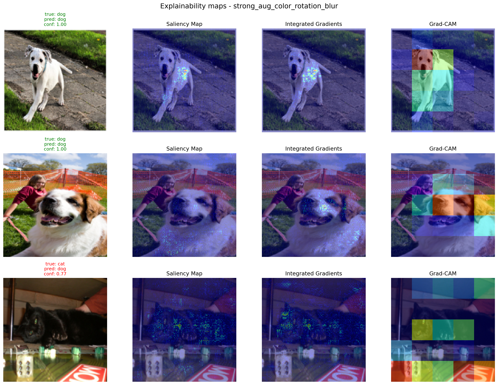
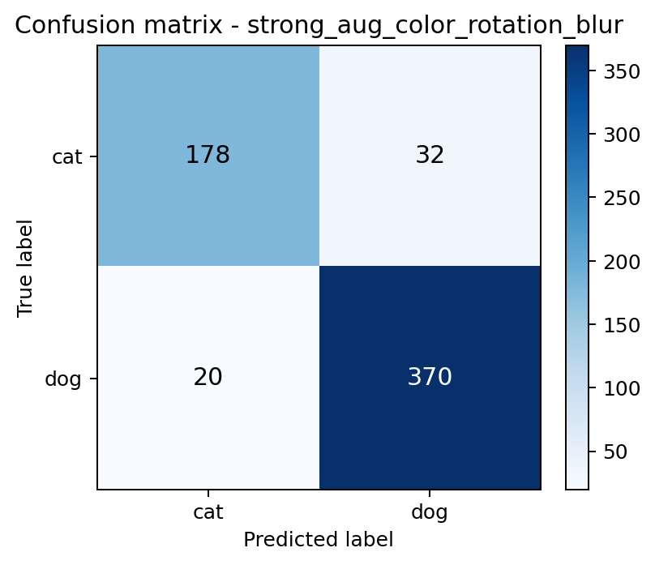
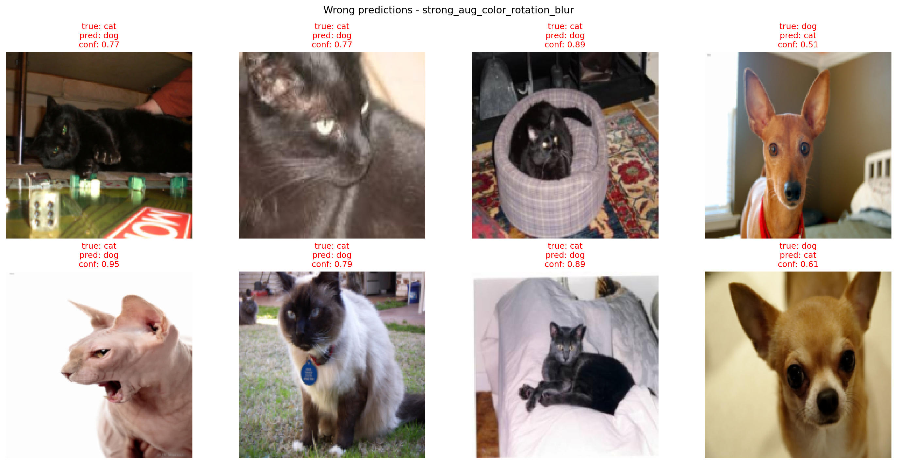

<div align="center">

# Oxford Pets MLflow Augmentation

A compact computer vision experiment comparing data augmentation strategies for cat vs dog classification with PyTorch, MobileNetV3 and MLflow.


</div>

This project trains a binary cat vs dog classifier on the Oxford-IIIT Pet dataset. It compares baseline, light augmentation and strong augmentation setups, tracks each experiment with MLflow and saves visual artifacts such as prediction grids, training curves and explainability maps.

## Preview

The model was tested on sample images from the test set.
Green labels mean correct predictions, while red labels show mistakes.


## Explainable AI preview

The project also generates visual explanations for model predictions. For selected test images, the script saves three explainability methods:

- **Saliency Map** - highlights pixels that strongly affect the prediction,
- **Integrated Gradients** - estimates how much each image region contributes compared with a baseline image,
- **Grad-CAM** - shows which high-level image regions were important for the convolutional feature extractor.

These visualizations help check whether the model focuses on the animal or learns shortcuts from the background.



## Project goal

The goal of this project was to check whether image augmentation improves cat vs dog classification results and to keep the whole experiment reproducible with MLflow.

The extended version also adds an explainability stage, so each run can be analyzed not only by metrics, but also by visual evidence showing what influenced the model prediction.

The experiment tracks:

- training parameters,
- metrics for every epoch,
- loss and metric plots,
- image grids before and after augmentation,
- test set samples,
- prediction grids,
- confusion matrices and wrong prediction grids,
- explainability maps,
- trained PyTorch models,
- comparison of multiple MLflow runs.

## Dataset

The project uses the **Oxford-IIIT Pet** dataset from `torchvision.datasets`.

The original dataset contains 37 pet breeds. In this project, the labels are converted into a binary classification task:

| Label | Class |
|---:|---|
| `0` | cat |
| `1` | dog |

For faster local training, only a subset of the dataset is used:

```python
MAX_TRAIN_SAMPLES = 1200
MAX_TEST_SAMPLES = 600
```

## Model

The classifier is based on **MobileNetV3 Small** with pretrained ImageNet weights.

The feature extractor is frozen and only the final classifier layer is trained for two output classes:

```python
for param in model.features.parameters():
    param.requires_grad = False
```

This keeps the experiment lightweight while still using transfer learning.

## Augmentation experiments

Each augmentation strategy is logged as a separate MLflow run.

| Run name | Description |
|---|---|
| `baseline_no_aug` | Resize, tensor conversion and ImageNet normalization only |
| `light_aug_flip_crop` | Horizontal flip, small rotation and random crop |
| `strong_aug_color_rotation_blur` | Horizontal flip, stronger rotation, color jitter, Gaussian blur and random crop |

## Final results

Results after 3 epochs:

| Run | Accuracy | Precision | Recall | F1 | Loss |
|---|---:|---:|---:|---:|---:|
| `strong_aug_color_rotation_blur` | 0.913 | 0.920 | 0.949 | 0.934 | 0.202 |
| `light_aug_flip_crop` | 0.912 | 0.906 | 0.964 | 0.934 | 0.228 |
| `baseline_no_aug` | 0.903 | 0.886 | 0.977 | 0.929 | 0.244 |

The best final result was achieved by `strong_aug_color_rotation_blur`. The difference between strong and light augmentation was very small, but both augmentation variants slightly outperformed the baseline in the final epoch.

## Error analysis

The project also saves a confusion matrix and a grid of wrong predictions for each MLflow run. This makes it easier to inspect not only aggregate metrics, but also the concrete cases where the classifier failed.

The examples below come from the best final run, `strong_aug_color_rotation_blur`.

The confusion matrix shows how often cats and dogs were classified correctly or confused with the opposite class.



The wrong prediction grid shows selected misclassified test images with the true label, predicted label and prediction confidence. It helps inspect whether mistakes come from unclear images, unusual poses, partial visibility or background shortcuts.



## Limitations

- The experiment uses a limited local subset of the dataset: 1,200 training images and 600 test images.
- Results are reported from a single random seed and should not be treated as a full statistical benchmark.
- The model is trained for 3 epochs with a frozen MobileNetV3 feature extractor, so it does not compare fine-tuning strategies.
- Prediction confidence comes from softmax probabilities and should not be interpreted as calibrated certainty.

## Training curves

The project saves metric and loss plots as MLflow artifacts.


## Augmentation example

Example grid of training images after applying the strongest augmentation setup:


## Explainability methods

After training, the model is evaluated on selected test images and three explainability maps are generated.

| Method | What it shows |
|---|---|
| `Saliency Map` | Pixel-level sensitivity of the prediction. |
| `Integrated Gradients` | Contribution of pixels or regions compared with a zero baseline. |
| `Grad-CAM` | Class-discriminative regions based on the last convolutional feature layer. |

The generated image is saved locally and logged to MLflow as an artifact:

```text
explainability/
  xai_grid.png
```

In the MLflow UI, the image can be opened from the run artifacts section:

```text
Artifacts -> explainability -> xai_grid.png
```

## MLflow tracking

The experiment logs the following parameters:

- dataset,
- task,
- model,
- transfer learning flag,
- augmentation type,
- learning rate,
- batch size,
- epochs,
- optimizer,
- image size,
- number of train/test samples,
- device,
- explainability methods.

Metrics logged for every epoch:

- `train_loss`,
- `train_accuracy`,
- `loss`,
- `accuracy`,
- `precision`,
- `recall`,
- `f1`.

Artifacts logged to MLflow:

- images before augmentation,
- training images after augmentation,
- test set samples,
- prediction grid,
- confusion matrix,
- wrong predictions grid,
- explainability grid,
- loss plot,
- metrics plot,
- PyTorch model.

Example artifact structure:

```text
plots/
  loss_plot.png
  metrics_plot.png

predictions/
  predictions_grid.png

evaluation/
  confusion_matrix.png
  wrong_predictions_grid.png

explainability/
  xai_grid.png

samples/
  before_augmentation/
  epoch_1/
  epoch_2/
  epoch_3/

model/
```

## How to run

Python 3.10 is recommended.

Create and activate a virtual environment:

```powershell
py -3.10 -m venv .venv
.\.venv\Scripts\Activate.ps1
python -m pip install --upgrade pip setuptools wheel
pip install -r requirements.txt
```

Run training:

```powershell
python main.py
```

Run a faster single experiment:

```powershell
python main.py --run strong_aug_color_rotation_blur --epochs 1 --max-train-samples 200 --max-test-samples 100 --skip-xai
```

Copy the selected run artifacts to `docs/images` after training:

```powershell
python main.py --run strong_aug_color_rotation_blur --copy-docs-artifacts
```

Start MLflow UI:

```powershell
mlflow ui --backend-store-uri sqlite:///mlflow.db
```

Open in browser:

```text
http://127.0.0.1:5000
```

## Project structure

```text
oxford-pets-mlflow-augmentation/
|-- docs/
|   `-- images/
|       |-- predictions_grid.png
|       |-- explainability_xai_grid.png
|       |-- confusion_matrix.png
|       |-- wrong_predictions_grid.png
|       |-- metrics_plot.png
|       |-- loss_plot.png
|       `-- train_after_augmentation.png
|-- src/
|   `-- oxford_pets_mlflow_augmentation/
|       |-- __init__.py
|       |-- artifacts.py
|       |-- cli.py
|       |-- config.py
|       |-- data.py
|       |-- experiment.py
|       |-- model.py
|       |-- train.py
|       |-- utils.py
|       `-- xai.py
|-- main.py
|-- requirements.txt
|-- README.md
`-- .gitignore
```

The following folders/files should not be committed to GitHub:

```text
.venv/
data/
mlruns/
outputs/
mlflow.db
__pycache__/
.idea/
```

## Conclusions

Data augmentation slightly improved the final result in this experiment. The strongest augmentation achieved the best final accuracy and F1 score, but the difference compared with light augmentation was very small.

MLflow made the experiment easier to organize because every run stored its parameters, metrics, plots, images, explainability maps and model in one place. This made it simple to compare the baseline with the augmented training setups and inspect whether the model focused on meaningful image regions.
